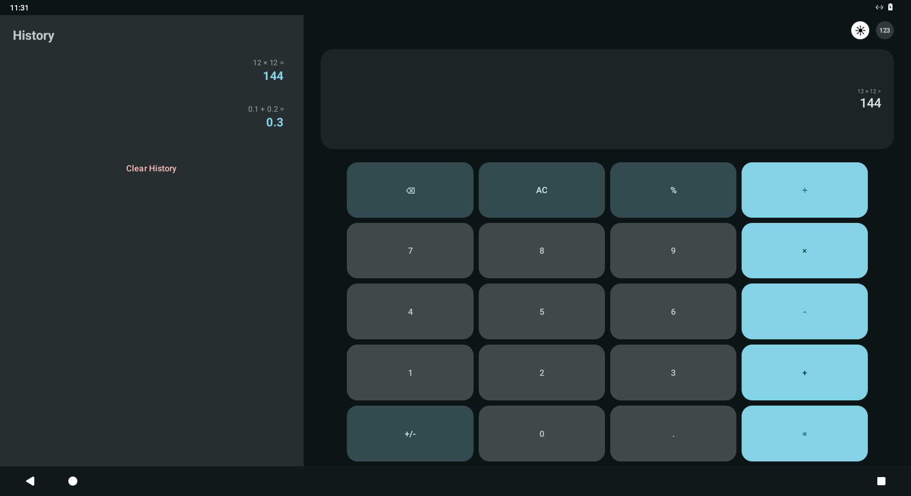
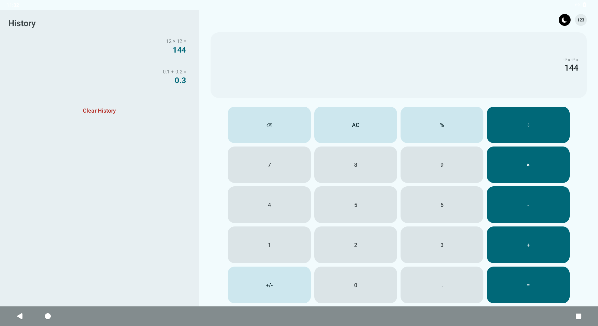
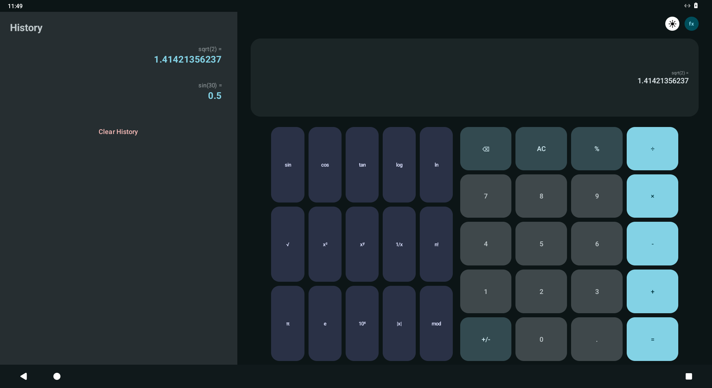
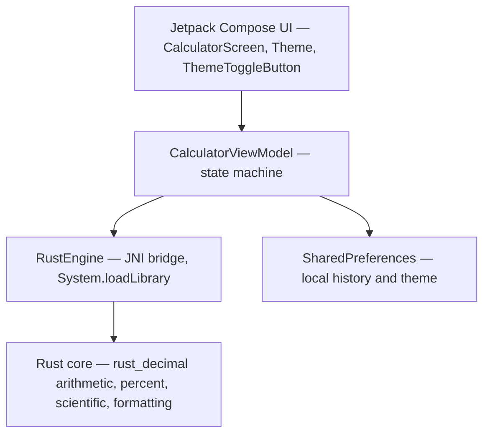

# OxiCalc

**A fast, adaptive calculator for Android — Jetpack Compose UI with a Rust calculation core.**

OxiCalc pairs a modern, Material You interface with a native arithmetic engine written in Rust.
All math runs in a stripped, LTO-optimized shared library behind a thin JNI bridge, while the UI
stays entirely in Kotlin/Compose. The result is an exact-decimal calculator that is small, private,
and pleasant to use on anything from a budget phone to a landscape tablet.

| Dark | Light | Scientific |
| :--: | :---: | :--------: |
|  |  |  |

---

## Features

- **Exact decimal arithmetic** — powered by Rust's `rust_decimal`: `0.1 + 0.2` is `0.3`, and large integer
  products such as `111111111 × 111111111` are returned in full, never as floating-point noise.
- **Deep scientific engine** — `sin`, `cos`, `tan`, `asin`, `acos`, `atan` (degrees), `log`, `ln`, `exp`,
  `10ˣ`, `√`, `∛`, `x²`, `xʸ`, `1/x`, `n!`, `|x|`, `mod`, `π`, `e` — rounded to 12 significant digits so
  `sin(30°)` prints `0.5`, not `0.49999999999999994`.
- **Robust error handling** — domain errors (`√-1`, `log 0`, `tan 90°`, `÷ 0`) report a localized *Error*
  instead of garbage or a crash.
- **Material You** — dynamic color adapts to the system theme on Android 12+, with a curated
  Water Blue fallback palette for older devices.
- **Modern theme toggle** — a hand-drawn (Canvas) sun/moon control; no icon pack shipped.
- **Adaptive layout** — a single codebase that reflows gracefully across portrait phones, landscape
  phones and tablets (side-by-side history), tested down to cramped, high-density screens.
- **Local history** — the last 100 calculations, stored on-device and restorable with one tap.
- **8 languages** — English, Turkish, German, French, Spanish, Russian, Japanese and Arabic.
- **Privacy first** — no network access, no analytics, no accounts. Everything stays on the device.

---

## Architecture

The app is deliberately split into two layers: a Compose UI and a Rust core, connected by JNI.



- **The UI (Kotlin / Jetpack Compose)** owns rendering, layout, input and state. It never performs arithmetic.
- **The core (Rust)** owns the numbers: the four basic operations, percent, the scientific functions
  and result formatting. It is compiled per Android ABI into `liboxicalc_core.so`.
- **The bridge (`RustEngine`)** is a few `external fun` declarations. Invalid operations (e.g. division
  by zero) return an empty string, which the ViewModel surfaces as a localized error.

---

## Tech stack

| Layer | Technology |
| --- | --- |
| UI | Jetpack Compose, Material 3 (dynamic color) |
| State | `ViewModel` + Compose snapshot state |
| Calculation core | Rust (`rust_decimal`, `jni` crate) |
| Interop | JNI, per-ABI `.so` (`arm64-v8a`, `armeabi-v7a`, `x86_64`) |
| Persistence | `SharedPreferences` (local history, theme) |
| Build | Gradle (Kotlin DSL), AGP 9, `cargo-ndk` |

---

## Compatibility & performance

- Runs on **Android 7.1 (API 25)** and up, from budget phones to tablets.
- The UI keeps heavyweight dependencies out and the whole screen is a single Compose tree with
  `graphicsLayer`-driven animations (no per-frame recomposition); history items and button models are
  `@Immutable` so Compose can skip them.
- The Rust core is a single stripped, LTO-optimized `.so` per ABI and is verified by unit tests:

  ```bash
  cd rust-core && cargo test
  ```

---

## Project structure

```
OxiCalc/
├── app/                                  # Android application module
│   ├── build.gradle.kts                  # app config + cargo-ndk Rust build task
│   └── src/main/
│       ├── AndroidManifest.xml
│       ├── kotlin/com/oxi/calc/
│       │   ├── MainActivity.kt           # edge-to-edge entry point
│       │   ├── App.kt                    # theme + screen host
│       │   ├── CalculatorScreen.kt       # the entire Compose UI
│       │   ├── ThemeToggleButton.kt      # Canvas-drawn sun/moon control
│       │   ├── CalculatorViewModel.kt    # UI state machine (delegates math to Rust)
│       │   ├── engine/RustEngine.kt      # JNI bridge
│       │   └── ui/theme/                 # Material You theme (Color, Type, Theme)
│       └── res/                          # strings (8 locales), icons, themes
└── rust-core/                            # Rust calculation core
    ├── Cargo.toml
    └── src/lib.rs                        # arithmetic + JNI exports
```

---

## Building

### Prerequisites

- **JDK 21**
- **Android SDK** — platform `android-36`, build-tools `36.0.0`
- **Rust toolchain** (via [rustup](https://rustup.rs)) with the Android targets:
  ```bash
  rustup target add aarch64-linux-android armv7-linux-androideabi x86_64-linux-android
  ```
- **Android NDK** (r29) and **cargo-ndk**:
  ```bash
  cargo install cargo-ndk
  ```

### Build & run

```bash
# point Gradle at your SDK
echo "sdk.dir=$ANDROID_HOME" > local.properties

# debug build (compiles Rust automatically via the cargoNdkBuild task)
./gradlew :app:assembleDebug

# release build (R8 shrinking + optimization)
./gradlew :app:assembleRelease
```

The Rust core is built by the `cargoNdkBuild` Gradle task, which runs automatically before
`preBuild` and drops the resulting `.so` files into the APK's `jniLibs`.

### Tests

The calculation engine has a Rust test suite covering exact arithmetic, rounding, domain errors and
the scientific functions:

```bash
cd rust-core && cargo test
```

---

## Localization

UI strings live in `app/src/main/res/values-*` and ship in 8 languages:

`en` · `tr` · `de` · `fr` · `es` · `ru` · `ja` · `ar`

---

## Privacy

OxiCalc collects nothing and talks to no server. History and preferences are stored only in the
app's private storage. See [PRIVACY_POLICY.md](PRIVACY_POLICY.md) for details.

---

## License

This project is open-source. Feel free to contribute!
